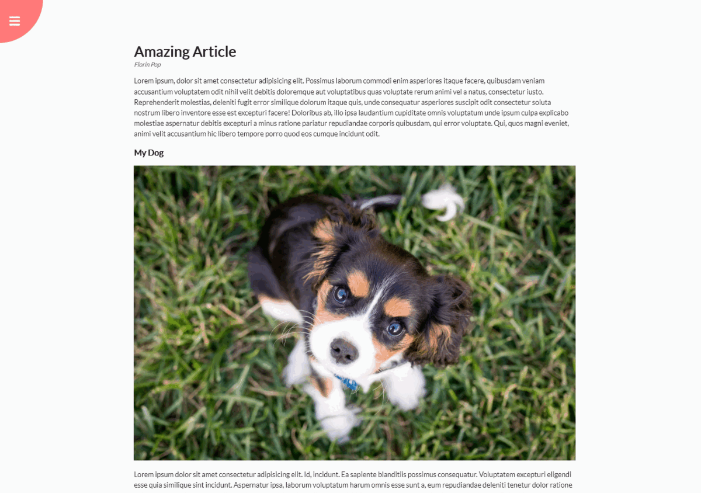
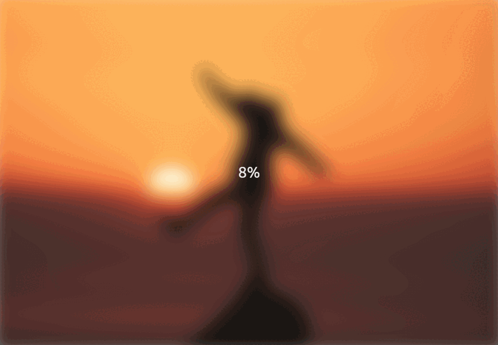
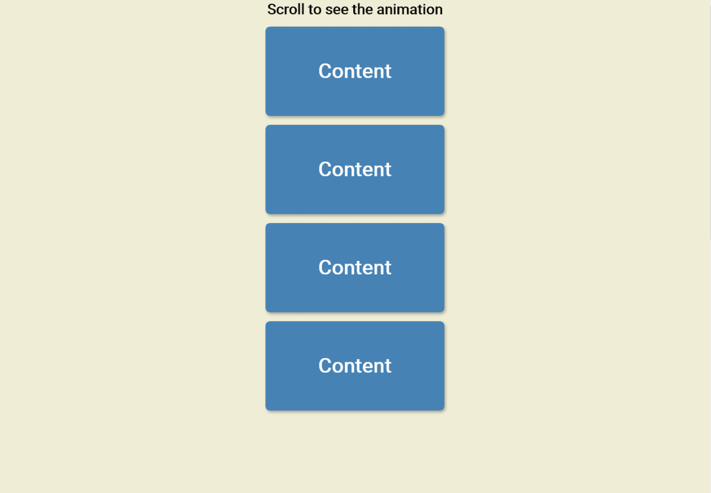
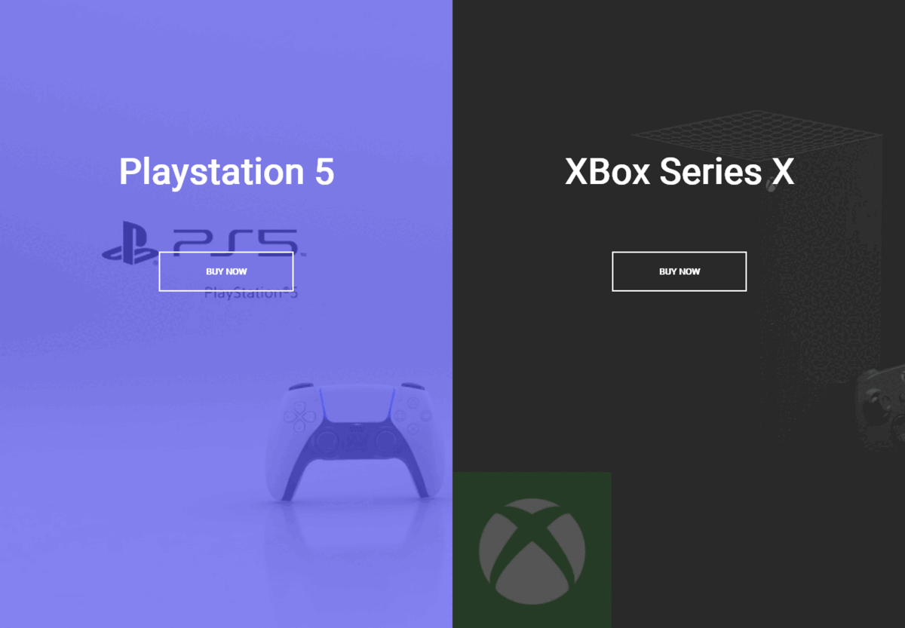
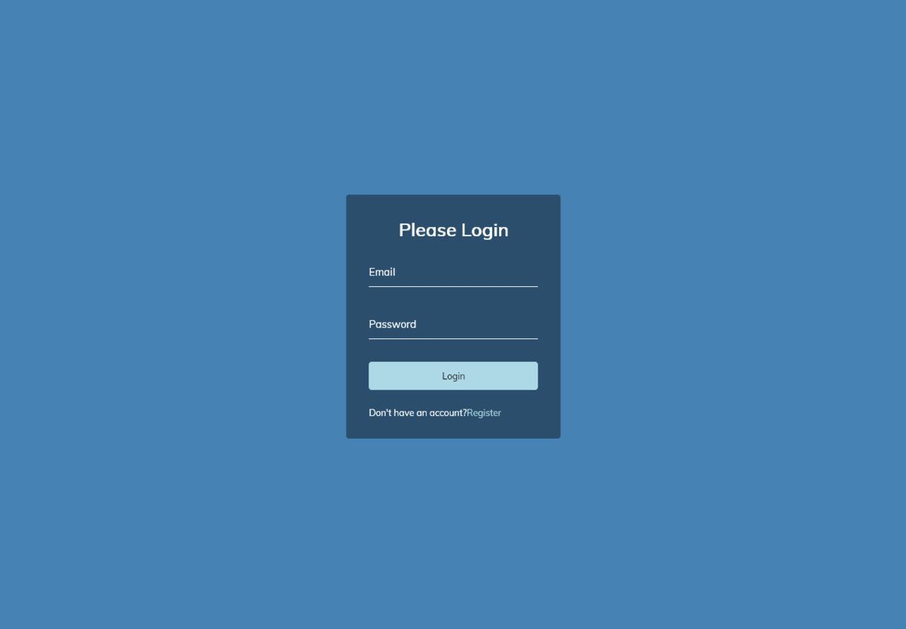
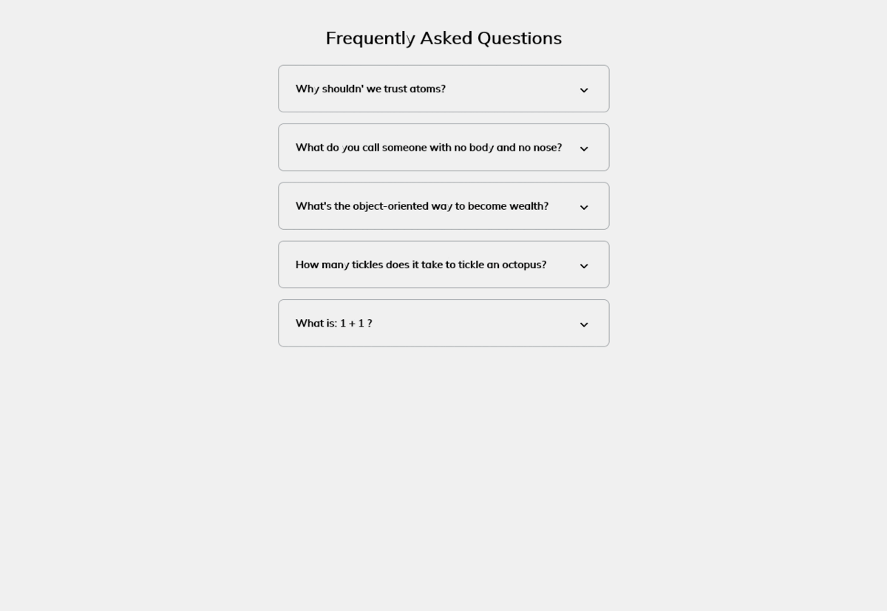

# 50 Projects In 50 Days Course Projects

## `1 - ExpandingCards-Project`

##### Using Html,Css and JavaScript

#

## `2 - ProgressSteps-Project`

##### Using Html,Css and JavaScript

#

## `3 - RotatingNavigation-Project`

##### Using Html,Css and JavaScript

#

## `4 - HiddenSearchWidget-Project`

##### Using Html,Css and JavaScript

#

## `5 - BlurryLoading-Project`

##### Using Html,Css and JavaScript

#

## `6 - ScrollAnimation-Project`

##### Using Html,Css and JavaScript

#

## `7 - SplitLandingPage-Project`

##### Using Html,Css and JavaScript

#

## `8 - FormWaveAnimation-Project`

##### Using Html,Css and JavaScript

#

## `9 - DadJokes-Project`

##### Using Html,Css and JavaScript(fetching api)

#

## `10 - EventKeyCode-Project`

##### Using Html,Css and JavaScript

#

## `11 - FAQCollapse-Project`

##### Using Html,Css and JavaScript

#
