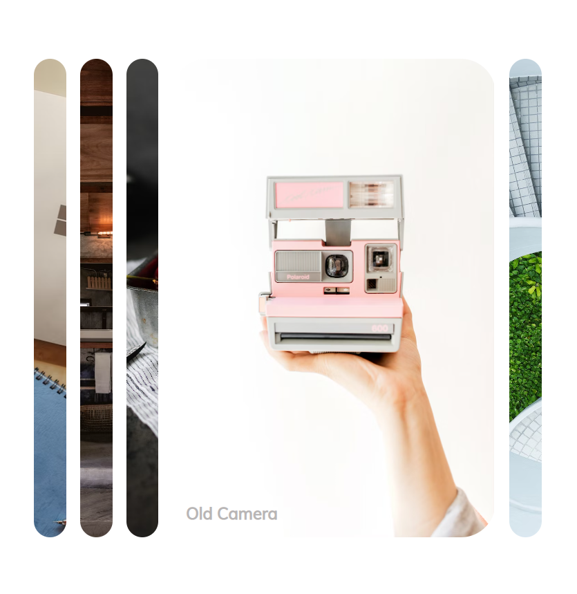
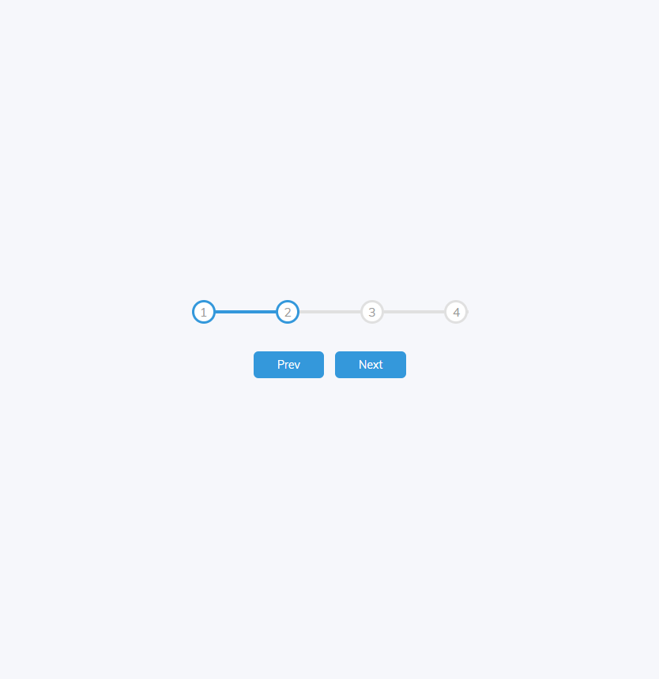
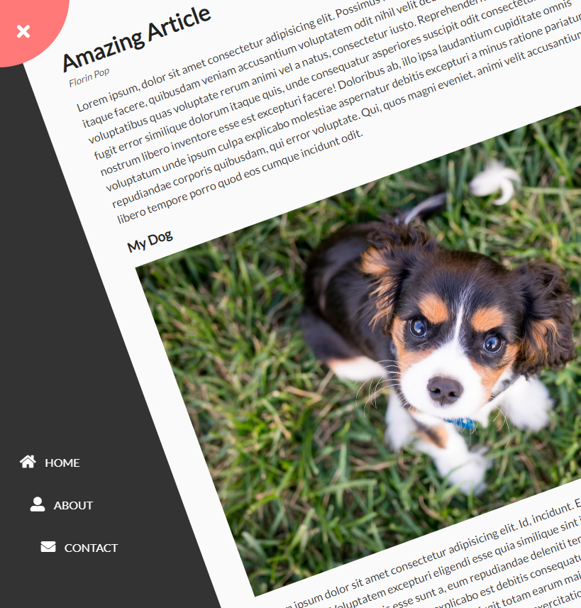
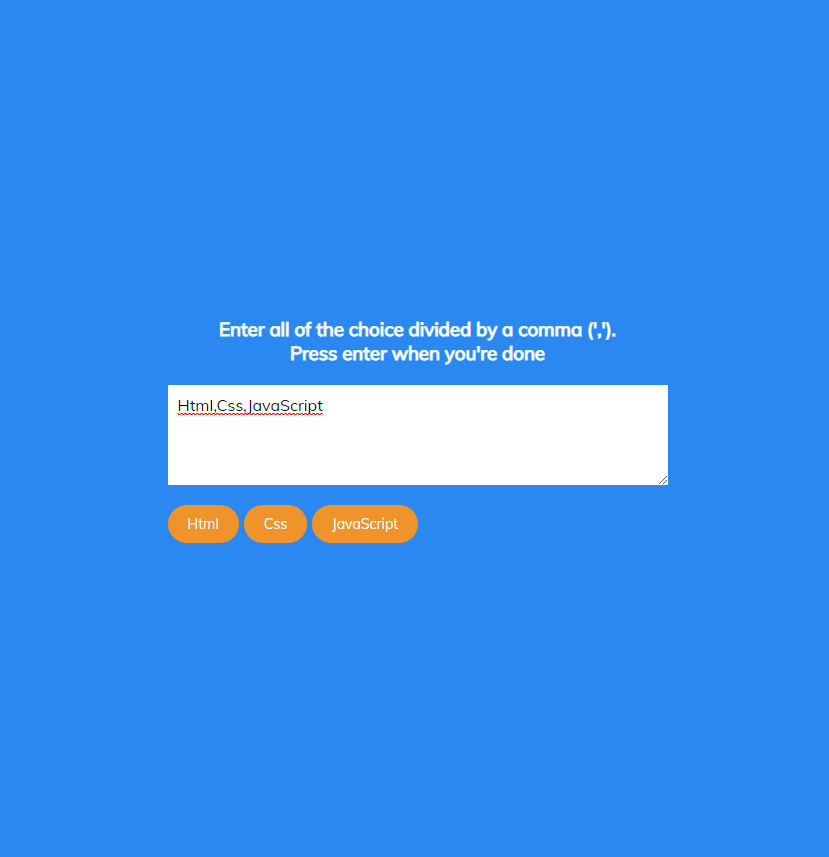
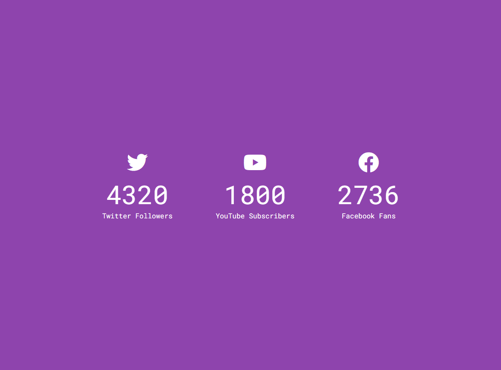
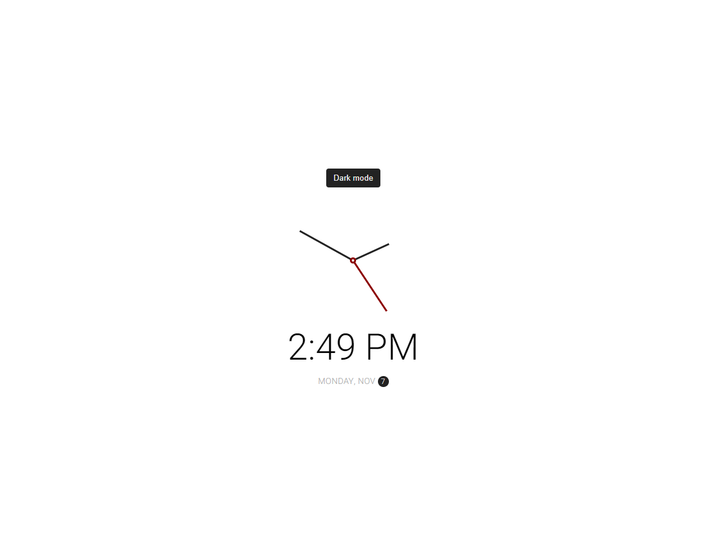

# 50 Projects In 50 Days Course Projects

## `1 - ExpandingCards-Project`

##### Using Html,Css and JavaScript

[LIVE_URL](https://tm-expanding-cards-dova.netlify.app/)

#

## `2 - ProgressSteps-Project`

##### Using Html,Css and JavaScript

[LIVE_URL](https://tm-progress-steps-dova.netlify.app/)

#

## `3 - RotatingNavigation-Project`

##### Using Html,Css and JavaScript

[LIVE_URL](https://tm-rotating-navigation-dova.netlify.app/)

#

## `4 - HiddenSearchWidget-Project`

##### Using Html,Css and JavaScript

[LIVE_URL](https://tm-hidden-search-widget-dova.netlify.app/)

#

## `5 - BlurryLoading-Project`

##### Using Html,Css and JavaScript

[LIVE_URL](https://tm-blurry-loading-dova.netlify.app/)

#

## `6 - ScrollAnimation-Project`

##### Using Html,Css and JavaScript

[LIVE_URL](https://tm-scroll-animation-dova.netlify.app/)

#

## `7 - SplitLandingPage-Project`

##### Using Html,Css and JavaScript

[LIVE_URL](https://tm-split-landing-page-dova.netlify.app/)

#

## `8 - FormWaveAnimation-Project`

##### Using Html,Css and JavaScript

[LIVE_URL](https://tm-form-wave-animation-dova.netlify.app/)

#

## `10 - DadJokes-Project`

##### Using Html,Css and JavaScript(fetching api)

[LIVE_URL](https://tm-dad-jokes-dova.netlify.app/)

#

## `11 - EventKeyCode-Project`

##### Using Html,Css and JavaScript

[LIVE_URL](https://tm-event-key-codes-dova.netlify.app/)

#

## `12 - FAQCollapse-Project`

##### Using Html,Css and JavaScript

[LIVE_URL](https://tm-faq-collapse-dova.netlify.app/)

#

## `13 - RandomChoicePicker-Project`

##### Using Html,Css and JavaScript

[LIVE_URL](https://tm-random-choice-picker-dova.netlify.app/)

#

## `14 - AnimatedNavigation-Project`

##### Using Html,Css and JavaScript

[LIVE_URL](https://tm-animated-navigation-dova.netlify.app/)

#

## `15 - IncrementingCounter-Project`

##### Using Html,Css and JavaScript

[LIVE_URL](https://tm-incrementing-counter-dova.netlify.app/)

#

## `16 - DrinkWater-Project`

##### Using Html,Css and JavaScript

[LIVE_URL](https://tm-drink-water-dova.netlify.app/)

#

## `17 - MovieApp-Project`

##### Using Html,Css and JavaScript

[LIVE_URL](https://tm-movie-app-dova.netlify.app/)

#

## `18 - BackgroundSlider-Project`

##### Using Html,Css and JavaScript

[LIVE_URL](https://tm-background-slider-dova.netlify.app/)

#

## `19 - ThemeClock-Project`

##### Using Html,Css and JavaScript

[LIVE_URL](https://tm-theme-clock-dova.netlify.app/)

#

## `20 - ButtonRippleEffect-Project`

##### Using Html,Css and JavaScript

[LIVE_URL](https://tm-button-ripple-effect-dova.netlify.app/)

#

## `21 - DragNDrop-Project`

##### Using Html,Css and JavaScript

[LIVE_URL](https://tm-drag-n-drop-dova.netlify.app/)

#

## `22 - Drawing-Project`

##### Using Html,Css and JavaScript

[LIVE_URL](https://tm-drawing-dova.netlify.app/)

#

## `23 - KineticCssLoader-Project`

##### Using Html,Css and JavaScript

[LIVE_URL](https://tm-kinetic-css-loader-dova.netlify.app/)

