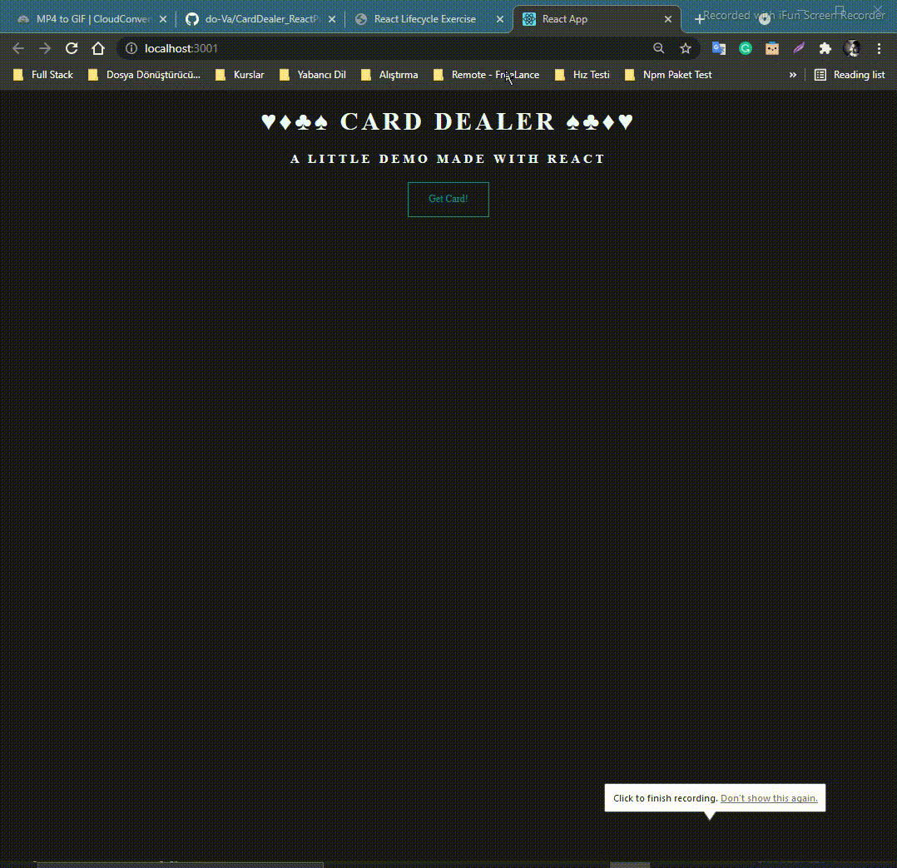

# **`Deck of Cards`**

Build an app that displays a deck of cards, one card at a time. When the page loads, send a request to https://deckofcardsapi.com/api/deck/new/shuffle to create a new deck. Store the Deck ID it gives you, so you can make further requests to retreive each card image. Add a button to your app that allows a user to draw a new card.

When a user clicks the button, send another request to the API, this time to https://deckofcardsapi.com/api/deck/${deck_id}/draw/. (make sure to use your actual deck ID). Use the data included in the response to display a new card image, and make sure to include an informative alt attribute.

Every time the user clicks, the app should display a new card until the deck is empty. Make sure to tell the user there are no cards left!

Here’s how this might look (with styling added):

