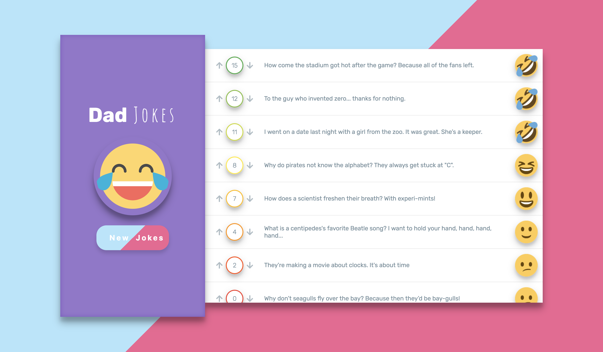

# **`Dad(CheeZ)Jokes App`**

Build an app that lets people view and vote on cheesy jokes. To generate jokes, you’ll use the [ICanHazDadJoke API](https://icanhazdadjoke.com/api).

When the page loads, it should fetch 10 jokes.

Your application should list the jokes, along with a “vote-up” button, a “vote-down” button, and the net score for each joke. Users can vote, and the net score should update.

## **`Further Study`**

- When jokes are loading, display a loading spinner or message notifying the user that the jokes are being loaded. This should hide once the jokes have finished loading.
- Make sure that there are no duplicate jokes shown.
- Show the jokes sorted by net score, and update this as the scores change.
- Store the list of jokes, with votes in local storage. When users visit the app, it should show saved jokes, rather than fetching new jokes. However, the user should still be able to generate new jokes via the button, and these new jokes should replace the ones in local storage.
- Add CSS styling for the joke app, including FontAwesome thumbs-up/down images for the voting buttons. Make the loading spinner using FA — you can spin any icon of theirs.
