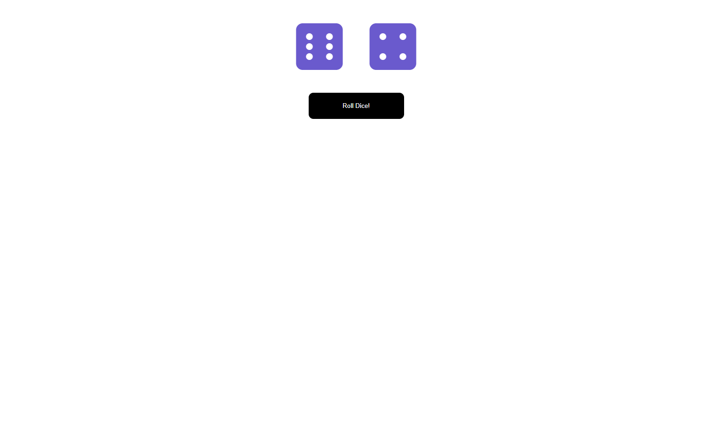
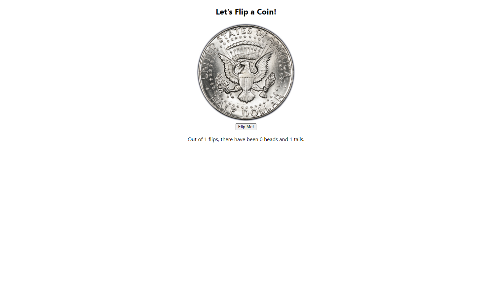
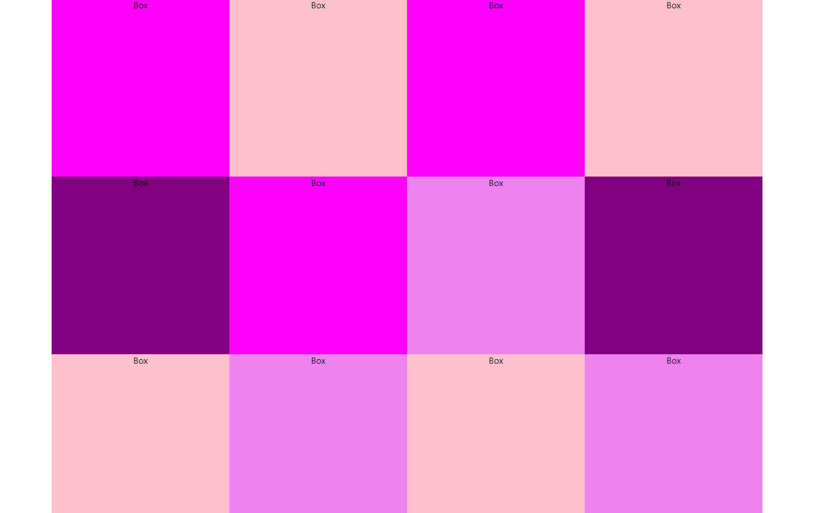
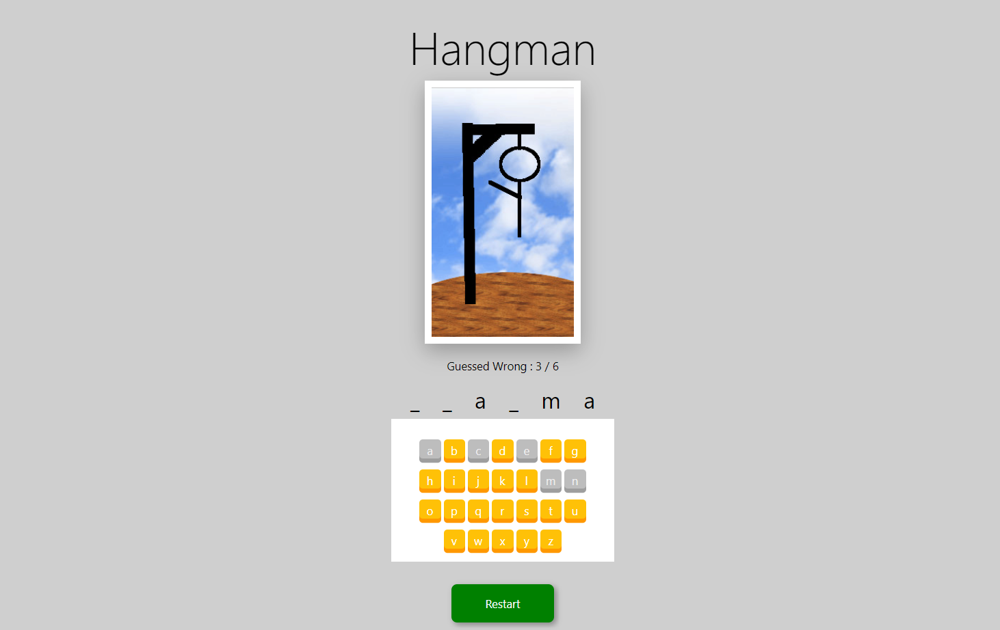

# The Modern React Bootcamp Course

## `1 - Pokedex-Project`

##### Using Html,Css and JavaScript(React) [LIVE-CODE-URL](https://cs-pokedex-dova.netlify.app/)

#

## `2 - RollDice-Project`

##### Using Html,Css and JavaScript(React) [LIVE-CODE-URL](https://cs-rolldice-dova.netlify.app/)

#

## `3 - CoinFlip-Project`

##### Using Html,Css and JavaScript(React) [LIVE-CODE-URL](https://cs-coinflip-dova.netlify.app/)

#

## `4 - ColorBoxes-Project`

##### Using Html,Css and JavaScript(React) [LIVE-CODE-URL](https://cs-color-boxes-dova.netlify.app/)

#

## `5 - Hangman-Project`

##### Using Html,Css and JavaScript(React) [LIVE-CODE-URL](https://cs-hangman-dova.netlify.app/)

