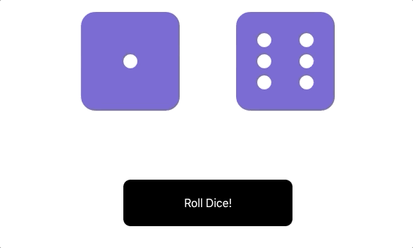

# **`React State Exercises`**

This exercise practices working with props, defaultProps, state, and simple click events in React.

Make a new React project with **`create-react-app`**.

## **`Roll Dice`**

Let’s build an app that lets us roll a pair of dice. Here’s a gif for some inspiration (this is the solution code running):

### **`Step 1: Component Structure`**

Make two components:

- RollDice - a parent component (rendered by App) that renders the dice and a button to roll.
- Die - an individual die that takes props and displays the correct face of the die based on props.

### **`Step 2: Making Dice`**

How are we going to render dice?

We could get six different image files, but there is a better way!

Font Awesome has handy dice classes for us: https://fontawesome.com/icons/dice-one?style=solid

`<i class="fas fa-dice-one"></i>`

`fas fa-dice-one` through `fas fa-dice-six` represent dice with different faces, 1-6.

To install font awesome for your React application, go into `public/index.html` and in the `<head>` tag, insert the **font-awesome CDN**.

This gives you access to any FA classes in the JSX.

Your `Die.js` component would just be an icon that dynamically changes its class to the proper die face based on props from the parent component’s state.

### **`Step 3: Rolling Dice`**

The `RollDice` component should have:

- the state for both of the dice
- a `roll()` method that rolls them to randomly get a new result

You can use `defaultProps` to set an array of six possible faces for each die.

Your `roll` method can pick a random element from the array for each die, then update the state, causing the dice to re-render to the appropriate values.

Remember that these values will have to be translated into `fas fa-dice-one` through `fas fa-dice-six` for the child component to receive the appropriate class name through its props.

Do you have to store each class name in the array or can you programmatically decide which one the `Die` components should have?

## **`Further Study`**

### **`Animation`**

The solution displays an animation every time the dice are rolled.

A new piece of state is necessary to say whether the dice are currently rolling or not.

This is done by appending a class containing a CSS animation, and then removing it after one second (hint: `setTimeout` with `setState`, but be careful what `this` references!).

### **`Changing Button Text`**

The button can also dynamically change its text and become disabled (un-clickable) until the animation has completed.

It relies on the additional piece of state that says whether the dice are currently rolling or not.
