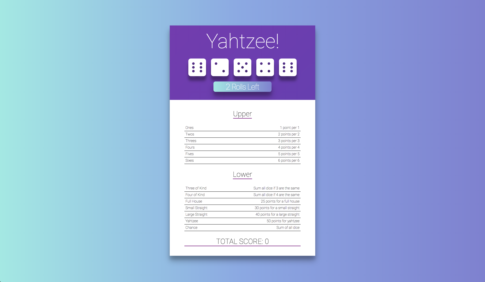
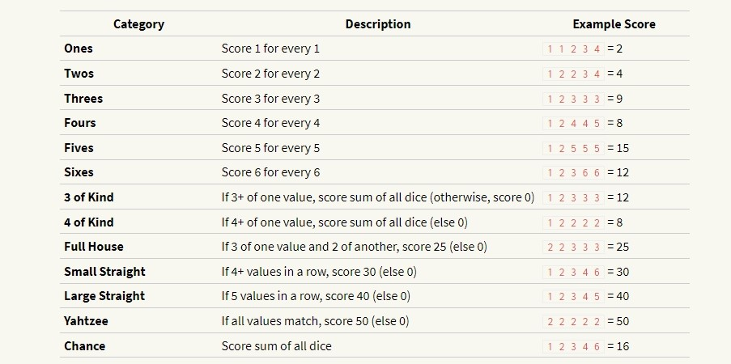

# **`Yahtzee Game`**

## **`Setup`**

1. Download starter code.

2. Install required npm libraries:

   `$ npm install`

3. Start The Server:

   `$ npm start`

## **`The Game`**

Yahtzee is a chance-and-strategy dice rolling game. A game is played over 13 rounds.

Each round, the player rolls five 6-sided dice. They may click on any number of dice to “freeze” or “unfreeze” them (frozen dice are displayed in a different color). They may re-roll the unfrozen dice up to 2 times.

Each round, they must assign their dice to any unclaimed scoring category. Each category scores differently.

After 13 rounds, the game is over, and the player’s score is the total of each scoring category.

### **`Scoring Categories`**

### **`Example Round`**

The initial roll is: `2 4 3 2 5`.

The player decides to try to get as many twos as possible, and clicks to freeze both twos, then re-rolls, getting a new `2 3 5`. They now have: `2 2 3 2 5`.

The player decides to try for a full house, and freezes all of their twos and their three (hoping to roll another 3 to get a full house). They re-roll the die showing five, getting a 6 and now have `2 2 3 2 6`.

Sadly, they didn’t get their full house. They could score this as:

- Twos: for 6 points
- Threes for 3 points
- Sixes: for 6 points
- Three of Kind: (twos) for 15 points
- Chance: for 15 points

Any other category they claimed on this round would score 0.

### **`Tasks`**

#### **`Part Zero: Run the Solution and Play`**

Play a game or two to get a sense of how things should work — this is the version you’ll be working to build.

#### **`Part One: Draw Diagram of Components`**

Read through the source code and make a diagram of the components, along with their props and state.

As you read the code, think about which areas felt very easy to understand, and whether there were things that took a minute to understand.

#### **`Part Two: Fix Clicking Dice`**

You’re supposed to click dice to toggle whether or not they’re going to be re-rolled. Unfortunately, this doesn’t work right now!

Figure out what’swrong or missing with the code for this feature and fix it!

#### **`Part Three: Read Rules.js`**

The system for evaluating a roll score is handled by a series of object oriented classes, since many of the rules are similar to each other.

Familiarize yourself with how this works, because up next you’ll be fixing some rules…

#### **`Part Four: Add Missing Rules`**

Two evaluation rule classes in Rules.js are incomplete:

- a full house should be 3 of one die and 2 of another, and should always score 25
- a small straight is four dice in a row (`1-2-3-4` or `2-3-4-5`, for example), and should always score 30
  Write the classes for these rules.

#### **`Part Five: Prevent Rolling More than 3 Times`**

You should only get two chances per turn to re-roll, but the game has a bug where you can re-roll as often as you want as long as you unlock some of the dice first. Fix it!

#### **`Part Six: Disallow Re-Using The Score Line`**

The game currently lets you keep re-scoring the same scoring line (so you can score 3 of a kind several times, whereas you should only be able to allocate one set of dice here.) Fix it!! (I’ve provided classes called RuleRow-active and RuleRow-disabled that you can use for styling purposes).

#### **`Part Seven: Add Descriptions`**

Add a description to each rule to explain how it’s scored (for example: “25 points for a full house”), and have it display before the user has clicked on a rule row. Once the user clicks a row, hide the description and instead display the score value.

#### **`Part Eight: Add Icons`**

Instead of rendering each Die as a simple number in a box, rewrite the code to use font-awesome die icons. You’ll need to include font-awesome, either using a CDN or try finding a node module to help! The classes you should use are: “fas fa-dice-one”, “fas fa-dice-two”, “fas fa-dice-three”, etc.

#### **`Part Nine: Animate The Dice!`**

This part is a little tricky! Make the Dice shake or spin when they are being rolled. Don’t worry about creating particularly beautiful animations. Make sure that a user cannot click on a Die to select it while the animation is going on.

#### **`Part Ten: Celebrate!`**

Yay! Nice job! You’ve completed the exercise, but the game still isn’t perfect… If you’re up for it, try adding in some of the following features…

## **`Further Study`**

There are lots of good ways to extend this game, letting you practice both React-specific and JavaScript-in-general concepts. Pick the ones that interest you.

#### **`React-Specific`**

- A bug not fixed in our solution: you can assign the same dice to more than one score line. Test and fix this.
- It would be nice if the game started with the dice already rolled (rather than having to click the button). Implement this.
- Show the total score.
- Add code to detect when the game is over, and add a “play again?” feature that resets the game.
- There’s an add-on library you could use with React for “styled components,” where you can move CSS out of .css files and into component definitions. Learn about this and try it out.

#### **`Non-React-Specific`**

- The look and feel is super-drab. Add some CSS. Perhaps even any animation for the dice when rolling!
- Add a new scoring category for “trash”; this should score only for dice that would not match any of the other right-hand categories (i.e., not three of a kind and not four of a kind and not a full house and …). What could be a good way to do this?
- It would be great to track the highest score ever. Use localStorage to keep track of this highest score so that it is displayed below the scoring area.
- Implement more complex scoring: you can find more complex rules to try out at https://en.wikipedia.org/wiki/Yahtzee#Yahtzee_bonuses_and_Joker_rules
